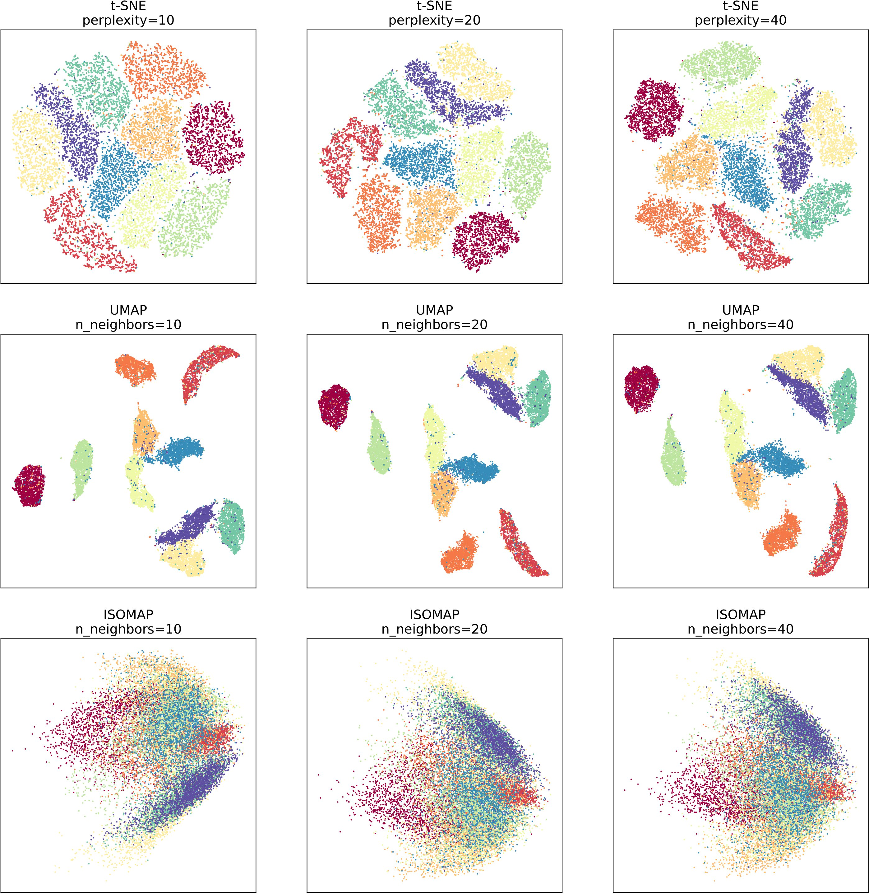
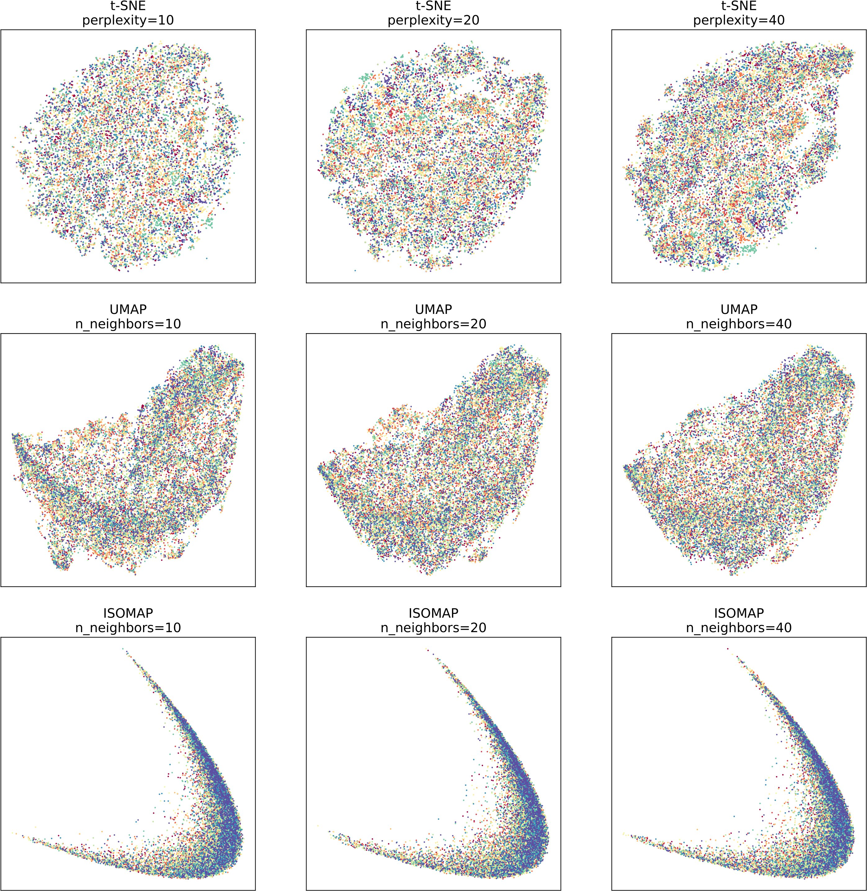
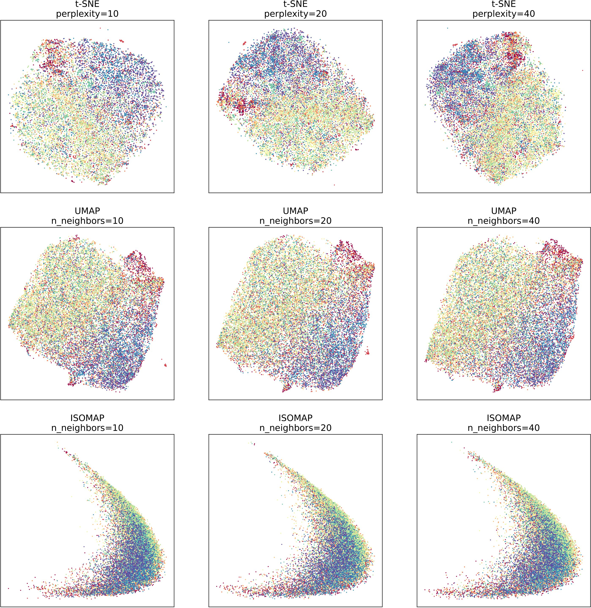

# COMP8503-2023-Assignment 1

This is an implementation on Python 3.8  to analyze the performance differences among various algorithms involved in dimensionality reduction (DR), namely **t-SNE**, **UMAP**, and **IsoMap**.

This code is submitted towards Assignment 1 for the PHD course COMP8503-2023 (taught by Prof. YU Yizhou) at HKUCS.

Note that **IsoMap** is my implementation for the assignment, illustrated by **Isomap.py** file, while **t-SNE** and **UMAP** are directly loaded from the corresponding third-party libraries.

**Besides, this work is on the basis of the [Course Project](https://github.com/lijichang/COMP9102-2022-CourseProject), which was finished by Zhao Ganlong and ME.**

To run the commands, first enter the **code** folder.

## Installation

You would require the following packages to fully use this code on your machine according to [installation](https://github.com/lijichang/COMP9102-2022-CourseProject/blob/main/installation.txt) file:

- scikit-learn
- numpy
- numba
- torchvision
- annoy
- umap-learn
- tqdm
- p_tqdm

You can use pip to install the above packages from PyPI. It will automatically install the dependencies for you:

```
pip install scikit-learn==0.24.1
pip install numpy==1.19
pip install numba==0.51.0
pip install torchvision==0.2.1
pip install annoy
pip install -U umap-learn==0.5.1
pip install -U tqdm==4.45.0
pip install -U p_tqdm==1.2
```

## Usage
### Get Features

To run various DR algorithms to obtain features on three standard datasets, namely **[MNIST](http://yann.lecun.com/exdb/mnist/)**, **[SVHN](http://ufldl.stanford.edu/housenumbers/)** and **[CIFAR-10](https://www.cs.toronto.edu/~kriz/cifar.html)**, you can run a command as follows. 

```
python get_DR_features.py
```

### Visualization

To visualize the features obtained from diverse DR algorithms as stated above, you can run a command as follows,
```
python visualization.py
```

## Experiments

### MNIST


### SVHN


### CIFAR-10


### Results
The experiment focuses on the validation of t-SNE, UMAP, and ISOMAP algorithms on three datasets - MNIST, SVHN, and CIFAR-10. The difficulty level of the three datasets varies from easy to hard, with MNIST being the easiest and CIFAR-10 being the hardest. Due to experimental constraints such as computing resources, we only selected 20,000 images from each dataset for algorithm testing.

The experimental results show that the three algorithms are more discriminative on simpler datasets and less discriminative on harder datasets. Additionally, it is evident that ISOMAP has lower discriminability compared to the other two algorithms on the same dataset, while t-SNE and UMAP have stronger discriminability.

### Conclusion
In summary, the experiment validates the effectiveness of t-SNE, UMAP, and ISOMAP algorithms on various datasets with different levels of difficulty. The results provide valuable insights for me in the field of data visualization and dimensionality reduction.


## Acknowledgement

Thanks to [COMP9102-2022-CourseProject](https://github.com/lijichang/COMP9102-2022-CourseProject).

This implementation is also submitted to my [GITHUB](https://github.com/lijichang/COMP8503-2023-Assignment1).


